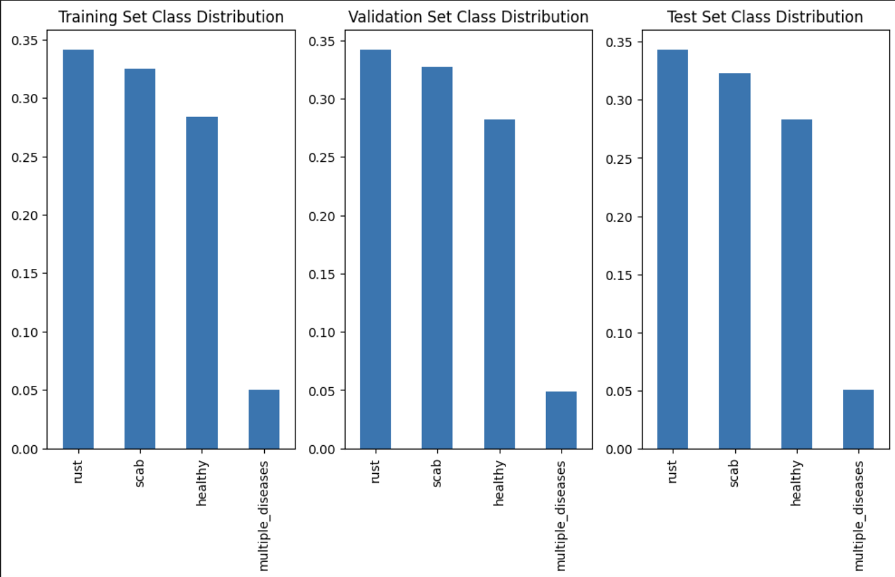

# Plant Pathology Classification Using Deep Learning

## Project Overview
This repository contains a deep learning project aimed at classifying plant diseases from images of leaves. The project utilizes DenseNet121 and EfficientNet models, incorporating modifications and ensemble techniques to optimize performance for plant pathology diagnostics.

## Table of Contents
- [Dataset](#dataset)
- [Data Preprocessing](#data-preprocessing)
- [Model Architectures](#model-architectures)
- [Training Procedures](#training-procedures)
- [Evaluation and Results](#evaluation-and-results)
- [Visualizations](#visualizations)
- [Usage Example](#usage-example)
- [Contributing](#contributing)
- [Citations](#citations)
- [License](#license)


## Dataset

This project utilizes a kagglePlant Pathology 2020 - FGVC7 comprising various categories of plant leaf images labeled as Healthy, Multiple Diseases, Rust, and Scab. The dataset aims to reflect real-world conditions and is designed to train robust models capable of handling diverse plant conditions

### Data Splitting

The dataset is split as follows to ensure the model’s ability to generalize well on unseen data:
- **70% Training**
- **20% Validation**
- **10% Test**

This stratified split ensures that each set reflects the overall distribution of classes as shown in the initial class distribution.

#### Class Distribution
The initial class distribution is as follows:
- **Healthy**: Approx. 550 images
- **Multiple Diseases**: Approx. 150 images
- **Rust**: Approx. 600 images
- **Scab**: Approx. 600 images


The class distribution across training, validation, and test sets is maintained proportionally, as visualized in the following charts:


### Data Preprocessing

Images undergo several preprocessing steps to augment the dataset and normalize input data:

1. **Resizing**: Normalizing all images to 512x512 pixels to ensure consistency.
2. **Augmentations**: Enhancing dataset variance through techniques such as random flips, rotations, color adjustments, and applying Gaussian blur. Below are examples of how these transformations affect the images:
3. **Normalization**: Scaling pixel values to a predefined range based on dataset statistics to facilitate model convergence.


## Visualizations

### Batch Visualization
To ensure that each training batch is representative of the overall dataset, we monitor the class distribution within batches. The typical distribution within a single batch is visualized as follows:


### Model Architectures 

#### DenseNet121


Performance Analysis Without Weighted Loss

Overview

In this section, we evaluate the performance of the DenseNet121 model prior to the implementation of weighted loss to handle class imbalance. This baseline assessment highlights the model’s capabilities and shortcomings across various classes, informing potential adjustments needed to enhance its predictive accuracy.

Training and Validation Loss

The Training and Validation Loss Plot provides insights into the model’s ability to learn over time. The blue line represents the training loss, indicating how well the model fits the training data through successive epochs. The orange line shows the validation loss, which tracks how well the model generalizes to new, unseen data.

Validation Accuracy

The Validation Accuracy Plot tracks the model’s accuracy on the validation set across epochs. It is a crucial metric for evaluating the effectiveness of the model under different training conditions.


- Key Observation: The training loss decreases steadily, suggesting that the model is effectively learning from the training data. However, the validation loss plateaus, indicating potential overfitting or a need for further parameter tuning to improve generalization. The validation accuracy initially increases, indicating that the model’s predictions are aligning better with the actual labels. The plateau in later epochs suggests that maximum efficacy might have been reached with the given model configuration and data.


Confusion Matrix

The Confusion Matrix offers a detailed view of the model’s performance across the classified labels, showing how many predictions were accurately classified and where misclassifications occurred.
- Healthy: Most healthy leaves were correctly identified, with very few misclassifications.
- Multiple Diseases: This class shows significant misclassification, suggesting difficulties the model faces in distinguishing these from other categories.
- Rust and Scab: Both classes were mostly well-identified, with high accuracy, but some were confused with each other.


Classification Report

| Class            | Precision | Recall | F1 Score | Support |
|------------------|-----------|--------|----------|---------|
| Healthy          | 0.90      | 0.96   | 0.93     | 28      |
| Multiple Diseases| 0.50      | 0.20   | 0.29     | 5       |
| Rust             | 0.97      | 0.94   | 0.96     | 34      |
| Scab             | 0.88      | 0.94   | 0.91     | 32      |
| **Accuracy**     |           |        | 0.91     | 99      |
| **Macro Avg**    | 0.81      | 0.76   | 0.77     | 99      |
| **Weighted Avg** | 0.90      | 0.91   | 0.90     | 99      |


DenseNet121 Model Performance with Weighted Loss

Introduction

In this segment, we explore the effects of implementing a weighted loss mechanism on the DenseNet121 model’s ability to classify plant diseases. Weighted loss is used to give more importance to minority classes in the training process, thus potentially improving the model’s performance in recognizing under-represented classes.

Performance Metrics After Weighted Loss

Post-adjustment, the overall metrics for the model show a notable improvement, especially in terms of balancing the recall and precision across classes:

| Metric     | Value  |
|------------|--------|
| Precision  | 0.8602 |
| Recall     | 0.8623 |
| F1 Score   | 0.8601 |


Classification Report

The classification report after applying weighted loss provides a detailed view of how the model’s performance has improved across all classes:

| Class            | Precision | Recall | F1 Score | Support |
|------------------|-----------|--------|----------|---------|
| Healthy          | 0.90      | 1.00   | 0.95     | 28      |
| Multiple Diseases| 0.60      | 0.60   | 0.60     | 5       |
| Rust             | 1.00      | 0.91   | 0.95     | 34      |
| Scab             | 0.94      | 0.94   | 0.94     | 32      |
| **Accuracy**     |           |        | 0.93     | 99      |
| **Macro Avg**    | 0.86      | 0.86   | 0.86     | 99      |
| **Weighted Avg** | 0.93      | 0.93   | 0.93     | 99      |

Training and Validation Loss


The plot displaying training and validation loss over epochs shows a promising trend. The training loss (blue line) decreases sharply and consistently from the beginning, which is indicative of the model effectively learning from the training data. The validation loss (orange line) also decreases, but at a slightly slower rate, which converges closer to the training loss as the epochs progress. This convergence suggests that the model is not just memorizing the training data but is also generalizing well to new, unseen data.
- Key Observation: The close proximity of the training and validation loss lines towards the later epochs suggests reduced overfitting. The model appears robust, managing to learn generalizable patterns rather than fitting to noise within the training data.

Validation Accuracy

The validation accuracy plot shows a steady increase in accuracy up to around the 6th epoch, after which the accuracy plateaus. This trend suggests that the model reaches its optimal performance capacity at this point, with further training yielding marginal gains.
- Key Observation: The plateau in validation accuracy could be an indicator that further model improvements might require adjustments beyond just additional training epochs, such as hyperparameter tuning, augmentation strategies, or even architectural changes.

Validation Accuracy

The Validation Accuracy Plot tracks the model’s accuracy on the validation set across epochs. It is a crucial metric for evaluating the effectiveness of the model under different training conditions.

- Key Observation: The training loss decreases steadily, suggesting that the model is effectively learning from the training data. However, the validation loss plateaus, indicating potential overfitting or a need for further parameter tuning to improve generalization. The validation accuracy initially increases, indicating that the model’s predictions are aligning better with the actual labels. The plateau in later epochs suggests that maximum efficacy might have been reached with the given model configuration and data.


Confusion Matrix

The confusion matrix provides a visual representation of where the model is performing well and where it is making errors. The matrix for the DenseNet121 model after applying weighted loss shows:
	•	Healthy: 26 out of 28 instances correctly predicted, indicating strong performance in identifying healthy leaves.
	•	Multiple Diseases: Improved recognition with 3 correct predictions out of 5. However, there is still some confusion with other classes, indicating room for improvement.
	•	Rust: Excellent performance with 31 out of 34 instances correctly predicted. The model shows high effectiveness in recognizing rust.
	•	Scab: Similarly strong performance with 30 out of 32 instances correctly predicted.
	•	Overall Analysis: The diagonal cells (from top left to bottom right), which represent correct classifications, contain the highest numbers, indicating that the model performs well across all classes. However, the off-diagonal cells show some misclassifications, especially between ‘Multiple Diseases’ and other classes, which could be an area to focus on in future training iterations.


<!-- ## Model Architectures

Detailed customizations are made to the following models to suit specific project needs:

### DenseNet121

Modified to have a custom classifier layer replacing the original fully connected layer to predict four classes.

### EfficientNet B1 & B2

These models are similarly adjusted in their final layers to output four disease categories.

## Training Procedures

Models are trained with a focus on handling class imbalance and optimizing generalization:

- **Loss Function**:  Utilization of Cross-Entropy Loss, class-weighted to mitigate class imbalance effects.
- **Optimizer**: Adam optimizer with an initial learning rate of 0.0001, adjusted by ReduceLROnPlateau on validation loss plateau.
- **Schedulers**: Learning rate adjustments using ReduceLROnPlateau for efficient convergence.

Training involves logging detailed metrics for each epoch to monitor progress and adjust parameters dynamically.

## Evaluation and Results

The models undergo rigorous evaluations using precision, recall, and F1-score metrics, supported by detailed error analysis through confusion matrices:

### Performance Metrics

Performance metrics are extensively discussed, emphasizing class-specific insights and overall model effectiveness.

### Visualizations

We apply Grad-CAM to visualize model decision regions on leaf images, providing insights into model focus areas.

## Usage Example

Here's how to load and use the trained model to predict on new leaf images:

\```python
from torchvision import models
import torch

# Load the model
model = models.densenet121(pretrained=False)
model.load_state_dict(torch.load('path_to_model.pth'))

# Prepare the image
from PIL import Image
from torchvision.transforms import transforms
transform = transforms.Compose([...])
image = Image.open('path_to_leaf_image.jpg').convert('RGB')
input_tensor = transform(image).unsqueeze(0)

# Predict
model.eval()
with torch.no_grad():
    outputs = model(input_tensor)
    _, predicted = outputs.max(1)
    print(f'Predicted class: {predicted.item()}')
\```

## Contributing

Feel free to fork this project, submit pull requests, or send suggestions to improve the code.

## Citations

Please cite this project as follows:

@misc{your_project_name,
  author = {Your Name},
  title = {Project Title},
  year = {2024},
  publisher = {GitHub},
  journal = {GitHub repository},
  howpublished = {\url{https://github.com/your_github}}
}

## License

This project is released under the MIT License. See the LICENSE file for details. -->
