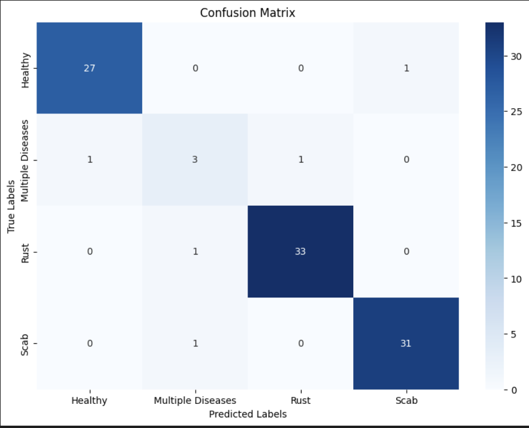
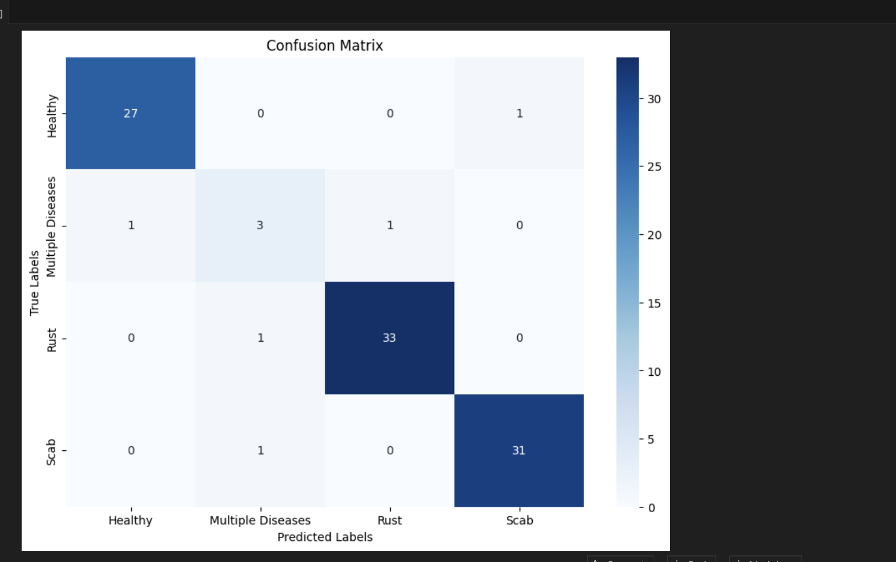
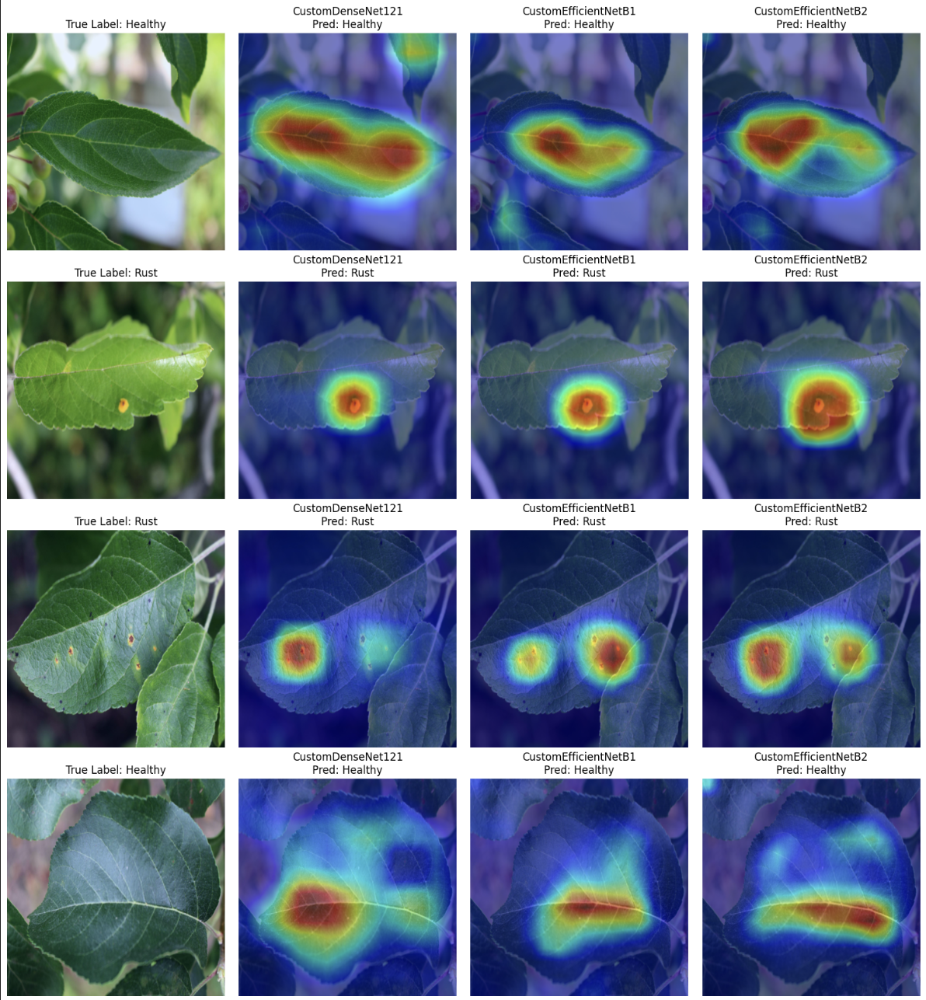
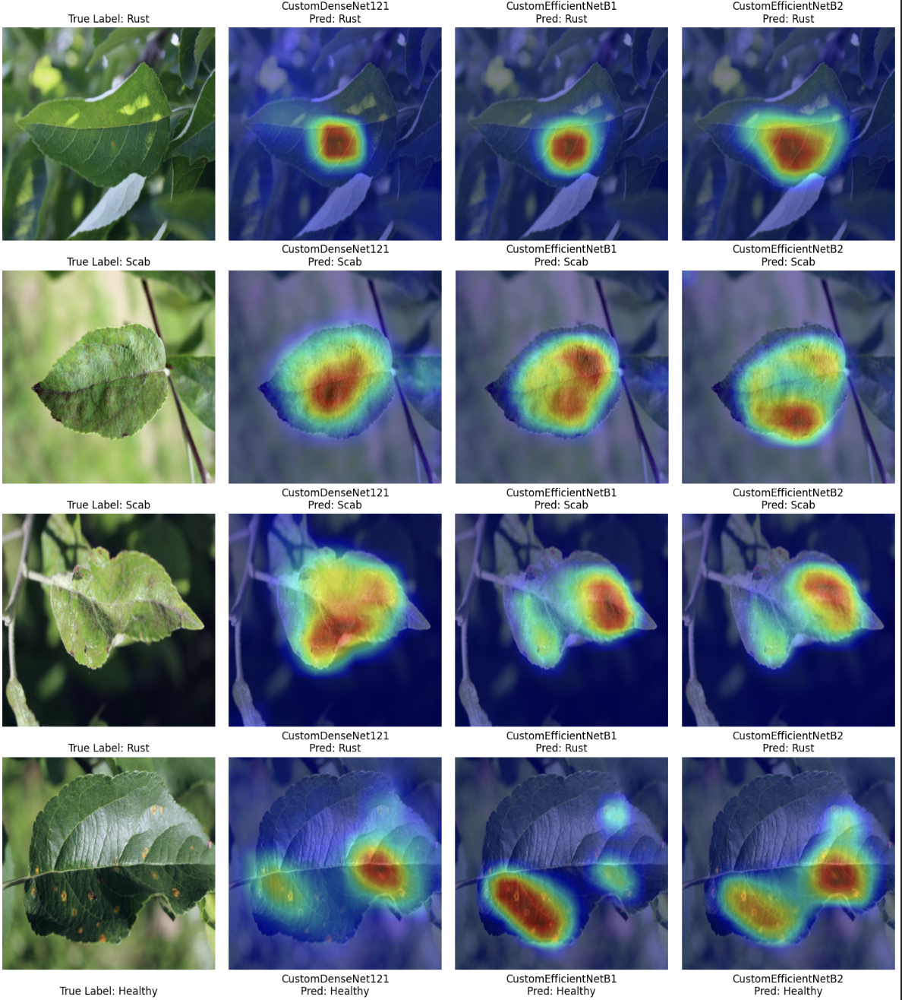

# Plant Pathology Classification Using Deep Learning

## Project Overview
This repository contains a deep learning project aimed at classifying plant diseases from images of leaves. The project utilizes DenseNet121 and EfficientNet models, incorporating modifications and ensemble techniques to optimize performance for plant pathology diagnostics.

## Table of Contents
- [Dataset](#dataset)
- [Data Preprocessing](#data-preprocessing)
- [Model Architectures](#model-architectures)
  - [Overview of Models Used](#overview-of-models-used)
  - [DenseNet121](#densenet121)
    - [Performance Without Weighted Loss](#performance-without-weighted-loss)
    - [Performance With Weighted Loss](#performance-with-weighted-loss)
  - [EfficientNetB1](#efficientnetb1)
  - [EfficientNetB2](#efficientnetb2)
  - [Ensemble Methods](#ensemble-methods)
    - [Average Ensemble](#average-ensemble)
    - [Soft Voting](#soft-voting)
- [Evaluation and Results](#evaluation-and-results)
  - [Model Performance Comparison and Analysis](#model-performance-comparison-and-analysis)
- [Grad-CAM Visualizations](#Grad-CAM-Visualizations)
- [Usage Example](#usage-example)
- [Contributing](#contributing)
- [Citations](#citations)
- [License](#license)

## Dataset

This project utilizes the Kaggle Plant Pathology 2020 - FGVC7 dataset, which comprises various categories of plant leaf images labeled as Healthy, Multiple Diseases, Rust, and Scab. The dataset is designed to reflect real-world conditions and train robust models capable of handling diverse plant conditions.

### Data Splitting

The dataset is split as follows to ensure the model's ability to generalize well on unseen data:
- **70% Training**
- **20% Validation**
- **10% Test**

This stratified split ensures that each set reflects the overall distribution of classes.

#### Class Distribution

The initial class distribution is as follows:
- **Healthy**: Approx. 550 images
- **Multiple Diseases**: Approx. 150 images
- **Rust**: Approx. 600 images
- **Scab**: Approx. 600 images

### Data Preprocessing

Images undergo several preprocessing steps to augment the dataset and normalize input data:
1. **Resizing**: Normalizing all images to 512x512 pixels to ensure consistency.
2. **Augmentations**: Enhancing dataset variance through techniques such as random flips, rotations, color adjustments, and applying Gaussian blur.
3. **Normalization**: Scaling pixel values to a predefined range based on dataset statistics to facilitate model convergence.

## Visualizations

### Batch Visualization

To ensure that each training batch is representative of the overall dataset, we monitor the class distribution within batches.

## Model Architectures

### Overview of Models Used

The project employs several models and techniques to address the challenges of plant pathology classification:
- DenseNet121
- EfficientNetB1
- EfficientNetB2
- Average Ensemble
- Soft Voting

### DenseNet121

DenseNet121 is a convolutional neural network that is distinct for its dense connectivity pattern. Unlike traditional networks, where each layer is connected only to the next layer, DenseNet connects each layer to every other layer in a feed-forward fashion. This unique architecture helps in alleviating the vanishing-gradient problem, strengthening feature propagation, encouraging feature reuse, and substantially reducing the number of parameters. DenseNet has proven to be effective in various image recognition tasks, particularly in areas where preserving fine details is crucial, such as medical imaging and plant pathology.

For a detailed performance analysis of DenseNet121 on plant pathology classification, see the [DenseNet121 section](#densenet121).

### DenseNet121 Performance Analysis

#### Performance without weighted Loss

##### Overview

This section evaluates the DenseNet121 model's performance without a weighted loss function, establishing a baseline for its capabilities and identifying areas for potential improvement.

##### Training and Validation Loss and Validation Accuracy

The Training and Validation Loss Plot shows how the model's performance changes over time. The training loss (blue line) indicates how well the model fits the training data, while the validation loss (orange line) assesses its generalization to unseen data. The Validation Accuracy Plot provides a crucial metric for assessing model effectiveness under varying training conditions.

- **Key Observation:** Steady decrease in training loss suggests effective learning, but the plateau in validation loss indicates possible overfitting.
- **Key Observation:** Increasing validation accuracy shows alignment with actual labels, though it plateaus, suggesting a limit to current model configuration benefits.

##### Confusion Matrix

The Confusion Matrix visualizes performance across classes, highlighting accurate classifications and misclassifications.

- **Key Observation:** High accuracy for most classes but notable misclassifications in 'Multiple Diseases'.

##### Classification Report

The table below summarizes the precision, recall, and F1 scores for each class before applying weighted loss.

| Class               | Precision | Recall | F1 Score | Support |
|---------------------|-----------|--------|----------|---------|
| Healthy             | 0.90      | 0.96   | 0.93     | 28      |
| Multiple Diseases   | 0.50      | 0.20   | 0.29     | 5       |
| Rust                | 0.97      | 0.94   | 0.96     | 34      |
| Scab                | 0.88      | 0.94   | 0.91     | 32      |
| **Accuracy**        |           |        | 0.91     | 99      |
| **Macro Avg**       | 0.81      | 0.76   | 0.77     | 99      |
| **Weighted Avg**    | 0.90      | 0.91   | 0.90     | 99      |

#### Performance with weighted Loss

##### Introduction

Implementing weighted loss addresses class imbalance by emphasizing minority classes during training, potentially enhancing overall model accuracy and equity.

##### Performance Metrics Post-Weighted Loss

Post-adjustment metrics indicate improved balance and performance across classes.

| Metric     | Value  |
|------------|--------|
| Precision  | 0.8602 |
| Recall     | 0.8623 |
| F1 Score   | 0.8601 |

##### Classification Report Post-Weighted Loss

Detailed performance per class after applying weighted loss highlights improvements.

| Class               | Precision | Recall | F1 Score | Support |
|---------------------|-----------|--------|----------|---------|
| Healthy             | 0.90      | 1.00   | 0.95     | 28      |
| Multiple Diseases   | 0.60      | 0.60   | 0.60     | 5       |
| Rust                | 1.00      | 0.91   | 0.95     | 34      |
| Scab                | 0.94      | 0.94   | 0.94     | 32      |
| **Accuracy**        |           |        | 0.93     | 99      |
| **Macro Avg**       | 0.86      | 0.86   | 0.86     | 99      |
| **Weighted Avg**    | 0.93      | 0.93   | 0.93     | 99      |

##### Training and Validation Loss Post-Weighted Loss

The plot below shows training and validation loss over epochs, indicating a closer convergence between training and validation loss, suggestive of reduced overfitting.

##### Validation Accuracy Plot Post-Weighted Loss

A steady increase in validation accuracy shows the model's improved performance, reaching an optimal point around the 6th epoch.

##### Updated Confusion Matrix

This matrix reflects improved recognition of under-represented classes and overall accurate predictions.

### EfficientNetB1

EfficientNetB1 is a convolutional neural network that forms part of the EfficientNet family, known for balancing depth, width, and resolution through compound scaling. This model optimizes performance and efficiency by using a systematic approach to scale up CNNs, making it more effective without increasing complexity significantly.

EfficientNetB1 incorporates innovations such as MBConv, a mobile inverted bottleneck that utilizes depthwise separable convolutions to reduce computational demand, and squeeze-and-excitation blocks to enhance feature responses across channels. These features help it achieve higher accuracy with fewer parameters compared to other networks of similar size.

This model excels in tasks that require detailed image recognition, making it highly suitable for applications ranging from medical imaging to environmental monitoring, where precision is crucial.

For a detailed performance analysis of DenseNet121 on plant pathology classification, see the [EfficientNetB1 section](#Weighted-EfficientNetB1-Model-Performance-Analysis).

## Weighted EfficientNetB1 Model Performance Analysis

### Introduction

This section reviews the performance of the EfficientNetB1 model after implementing weighted loss to address class imbalances in our dataset. The weighted loss helps to enhance the model's sensitivity towards underrepresented classes, aiming for a more balanced and fair accuracy across all categories.

##### Training and Validation Loss for Weighted EfficientNetB1

The training and validation loss plot shows a substantial decrease in training loss from the initial epochs, which indicates the model is learning effectively from the training data. The validation loss initially decreases and then stabilizes, closely following the training loss, which suggests that the model is not overfitting significantly. This convergence of training and validation loss indicates a good generalization of the model under the current configuration. The convergence between the training and validation loss by the later epochs suggests that the model is well-tuned for the amount of training it received, with possibly minimal gains from additional training without further adjustments or more complex regularization techniques.

##### Validation Accuracy for Weighted EfficientNetB1

The validation accuracy plot shows an upward trend, indicating a consistent improvement in model performance on the validation set as training progresses. The model reaches a peak accuracy and maintains it, which is indicative of robust learning outcomes.The stable high accuracy in later epochs highlights the model’s capacity to maintain its performance, suggesting that the learning rate and other hyperparameters are well-set for this phase of training. The slight dips might indicate minor fluctuations in learning but aren’t significant enough to suggest major issues.

##### Classification Report for Weighted EfficientNetB1

The classification report reflects significant improvements in precision, recall, and F1 scores across almost all classes:

| Class            | Precision | Recall | F1 Score | Support |
|------------------|-----------|--------|----------|---------|
| Healthy          | 0.96      | 0.96   | 0.96     | 28      |
| Multiple Diseases| 0.60      | 0.60   | 0.60     | 5       |
| Rust             | 0.97      | 0.97   | 0.97     | 34      |
| Scab             | 0.97      | 0.97   | 0.97     | 32      |
| **Accuracy**     |           |        | 0.95     | 99      |
| **Macro Avg**    | 0.88      | 0.88   | 0.88     | 99      |
| **Weighted Avg** | 0.95      | 0.95   | 0.95     | 99      |

The marked improvement in the Multiple Diseases class from previous metrics indicates that the weighted loss is effective. The high scores in other classes reinforce the model’s capability to accurately classify different plant conditions.

##### Confusion Matrix for Weighted EfficientNetB1

The confusion matrix provides a detailed look at how the model performs across different classes:
- Healthy: Almost perfect prediction with 27 out of 28 correctly predicted.
- Multiple Diseases: This class shows a marked improvement with accurate predictions for 3 out of 5 instances, though there’s still some confusion with other classes, particularly Rust and Scab.
- Rust: High precision and recall with 33 out of 34 correctly predicted, showing that the model is very effective at identifying this condition.
- Scab: Similar to Rust, the model effectively identifies Scab with 31 out of 32 correct predictions.
- Overall Analysis: The confusion matrix reveals high accuracy across most classes with slight confusion between Multiple Diseases and other diseases, suggesting that further model refinement or more targeted data augmentation could help improve these

### EfficientNetB2

EfficientNetB2, part of the EfficientNet family, enhances model width, depth, and resolution balance using advanced techniques like progressive learning and compound coefficient fine-tuning. This optimization enhances efficiency and accuracy, making it ideal for complex image classification tasks in areas like medical diagnostics and manufacturing quality control.

## Weighted EfficientNetB1 Model Performance Analysis

### Introduction

This section reviews the performance of the EfficientNetB2 model after implementing weighted loss to address class imbalances in our dataset. 

##### Classification Report for Weighted EfficientNetB2

The detailed classification report for the EfficientNetB2 model underscores a balanced improvement across all categories, with the model achieving impressive precision, recall, and F1 scores for the classes, demonstrating the weighted loss's effect in providing a balanced approach to all classes.

| Class            | Precision | Recall | F1 Score | Support |
|------------------|-----------|--------|----------|---------|
| Healthy          | 0.90      | 0.93   | 0.91     | 28      |
| Multiple Diseases| 0.75      | 0.60   | 0.67     | 5       |
| Rust             | 0.97      | 1.00   | 0.99     | 34      |
| Scab             | 0.97      | 0.94   | 0.95     | 32      |
| **Accuracy**     |           |        | 0.94     | 99      |
| **Macro Avg**    | 0.90      | 0.87   | 0.88     | 99      |
| **Weighted Avg** | 0.94      | 0.94   | 0.94     | 99      |

### Confusion Matrix for Weighted EfficientNetB2

The confusion matrix for EfficientNetB2 further illuminates its precision in class predictions:

- **Healthy:** Correct predictions dominate, with minimal misclassification.
- **Multiple Diseases:** Improved recognition, though some instances are still confused with Rust and Scab, suggesting a need for more focused training on distinguishing features.
- **Rust:** Excellent predictive accuracy, correctly identifying nearly all cases.
- **Scab:** High accuracy with only a minor confusion with other classes.
- **Overall:** The matrix highlights the model's high accuracy and its proficiency in distinguishing between most classes, though slight enhancements could be made in distinguishing the Multiple Diseases class more distinctly.

## Ensemble Methods

### Introduction

This section reviews the performance of ensemble methods that integrate the strengths of DenseNet121, EfficientNetB1, and EfficientNetB2 models. We implemented two types of ensembles: average ensemble and soft voting, aiming to enhance accuracy and robustness in classifying plant diseases from leaf images.

#### Average Ensemble

##### Methodology
The average ensemble method calculates the mean output probabilities from each model, reducing variance among predictions and improving consistency across various classes.

##### Performance Metrics
- **Precision**: 0.93
- **Recall**: 0.94
- **F1 Score**: 0.94
- **Accuracy**: 94%

##### Detailed Insights
This method enhances overall accuracy and class-specific metrics, particularly improving precision and recall for the 'Multiple Diseases' class, addressing previous imbalances in performance.

##### Performance by Class
| Class            | Precision | Recall | F1 Score | Support |
|------------------|-----------|--------|----------|---------|
| Healthy          | 0.91      | 0.93   | 0.92     | 28      |
| Multiple Diseases| 0.68      | 0.60   | 0.64     | 5       |
| Rust             | 0.99      | 0.97   | 0.98     | 34      |
| Scab             | 0.95      | 0.94   | 0.95     | 32      |
| **Accuracy**     |           |        | 0.94     | 99      |
| **Macro Avg**    | 0.88      | 0.86   | 0.87     | 99      |
| **Weighted Avg** | 0.93      | 0.94   | 0.94     | 99      |

#### Soft Voting

##### Methodology
Soft voting considers the confidence of each model's predictions, weighting them to derive the final class decision. This approach leverages the specific strengths of each model, especially in terms of their confidence levels.

##### Performance Metrics
- **Precision**: 0.93
- **Recall**: 0.93
- **F1 Score**: 0.93
- **Accuracy**: 97%

##### Detailed Insights
The soft voting ensemble markedly enhances performance metrics across all categories, achieving the highest accuracy and macro-average metrics. Notably, it shows significant improvement in class balance and robustness, especially in the 'Multiple Diseases' category.

##### Performance by Class
| Class            | Precision | Recall | F1 Score | Support |
|------------------|-----------|--------|----------|---------|
| Healthy          | 0.93      | 1.00   | 0.97     | 28      |
| Multiple Diseases| 0.80      | 0.80   | 0.80     | 5       |
| Rust             | 1.00      | 0.97   | 0.99     | 34      |
| Scab             | 1.00      | 0.97   | 0.98     | 32      |
| **Accuracy**     |           |        | 0.97     | 99      |
| **Macro Avg**    | 0.93      | 0.94   | 0.93     | 99      |
| **Weighted Avg** | 0.97      | 0.97   | 0.97     | 99      |

### Visualizations and Further Analysis

#### Average Ensemble

##### Confusion Matrix
- **Healthy**: Shows near-perfect classification accuracy.
- **Multiple Diseases**: Displays noticeable improvement but still has room for further refinement.
- **Rust and Scab**: Exhibits high accuracy with minimal confusion.

#### Soft Voting

##### Confusion Matrix
- **Healthy**: Achieves almost perfect accuracy.
- **Multiple Diseases**: Significant enhancements in identifying this challenging class.
- **Rust and Scab**: Almost flawless classification with very high accuracy.

#### Conclusion
Both ensemble methods demonstrate superior performance over individual model predictions, with soft voting displaying particularly strong outcomes due to its consideration of model confidence levels. These methods prove to be effective in leveraging the collective capabilities of multiple advanced architectures to improve diagnostic accuracy in plant pathology.

## Evaluation and Results

### Model Performance Comparison and Analysis

This section delves into the performance metrics of individual models and ensemble methods, highlighting the gains achieved through the implementation of weighted loss and ensemble techniques.

#### Overview of Model Performances
The following analysis compares the precision, recall, F1 score, and accuracy across four configurations:

- **DenseNet121 (After Implementing Weighted Loss)**
- **EfficientNetB1 (Weighted Loss)**
- **Averaging Ensemble (Combination of DenseNet121 and EfficientNet Variants)**
- **Soft Voting Ensemble (Combination of DenseNet121 and EfficientNet Variants)**

#### Comparative Performance Metrics

| Model / Technique                       | Precision | Recall | F1 Score | Accuracy |
|-----------------------------------------|-----------|--------|----------|----------|
| **DenseNet121 (Weighted Loss)**         | 0.8602    | 0.8623 | 0.8631   | 93%      |
| **EfficientNetB1 (Weighted Loss)**      | 0.8759    | 0.8759 | 0.8759   | 95%      |
| **Averaging Ensemble**                  | 0.9000    | 0.9275 | 0.9117   | 96%      |
| **Soft Voting Ensemble**                | 0.9333    | 0.9348 | 0.9337   | 97%      |

##### Detailed Insights
- **DenseNet121** shows significant improvement in handling 'Multiple Diseases' with weighted loss, showcasing more balanced performance across classes.
- **EfficientNetB1** excels particularly in handling 'Rust' and 'Scab', slightly outperforming DenseNet121 in overall metrics, affirming its suitability for this dataset.
- **Averaging Ensemble** boosts overall accuracy and class-specific metrics, notably for 'Multiple Diseases'.
- **Soft Voting Ensemble** achieves the highest overall metrics, especially enhancing class balance and robustness, making it particularly effective for 'Multiple Diseases'.

### Analysis of Techniques

- **Impact of Weighted Loss**: Incorporating weighted loss has significantly enhanced class balance, especially benefiting 'Multiple Diseases', a category that initially showed lower performance metrics.
- **Comparison of Model Efficacy**: While EfficientNetB1 generally surpasses DenseNet121, the integration of these models in ensembles demonstrates superior performance than when operating individually.
- **Efficiency of Ensemble Methods**: The refinement from averaging to soft voting shows a clear progression in performance, with soft voting providing the most consistent and high-level results across all categories.

### Conclusions
The combined strategies of weighted loss and advanced ensemble techniques have led to substantial enhancements in model performance, especially in achieving class balance for challenging categories such as 'Multiple Diseases'. The soft voting ensemble, utilizing both DenseNet121 and EfficientNet variants, emerges as the most effective approach, achieving the highest accuracy and robustness across varied tests.

This analysis underscores the effectiveness of ensemble methods, particularly soft voting, in merging model strengths to boost performance, suggesting potential areas for future enhancements, such as exploring more complex ensemble techniques and targeted data augmentation for minor classes.

### Grad-CAM Visualizations

#### Understanding Model Decisions with Grad-CAM

Grad-CAM (Gradient-weighted Class Activation Mapping) provides a powerful visual tool to understand which parts of an image our models focus on when making predictions. This technique is particularly valuable in our project for assessing the interpretability and reliability of our models in diagnosing plant diseases from leaf images.

#### Purpose of Grad-CAM in Our Project

We apply Grad-CAM to the models involved in our study—DenseNet121, EfficientNetB1, and EfficientNetB2—to visualize the regions of interest that lead to specific class predictions. This method helps confirm whether the models are focusing on the pathological features of the leaves, such as spots, discolorations, or other disease indicators, which are crucial for accurate diagnostics.

#### Application and Insights

For each disease class, we generated heatmaps using Grad-CAM to show areas that significantly impact the model's decision-making process. These heatmaps are overlaid on the original leaf images, providing a clear visual representation of the model's focus areas:

- **Healthy Leaves**: Observations reveal that the models generally focus on the overall structure and vein patterns of the leaves, which are indicative of healthy growth.
- **Rust**: The models tend to concentrate on the orange-rusty spots characteristic of this disease, demonstrating their capability to recognize relevant disease features.
- **Scab**: The focus is primarily on the rough, scabby patches, aligning with the typical symptoms of this condition.
- **Multiple Diseases**: This category presents a challenge, and the heatmaps help verify whether the models are considering multiple affected areas comprehensively.

#### Visual Examples

Below are selected examples from our Grad-CAM analysis. Each row represents a different leaf condition, showing how each model processes and interprets the same image differently:

These visualizations are crucial for verifying the focal points of our predictive models and ensuring that their predictions are based on relevant features of the leaf images. They also serve as a tool for further refinement of our models, indicating potential areas for model training adjustments.

#### Conclusion

Grad-CAM visualizations offer an insightful and straightforward method to check and improve our models' interpretability. By continually analyzing these heatmaps, we can better understand model behavior, leading to more accurate and reliable plant disease diagnosis. This approach not only enhances our model's diagnostic abilities but also builds trust in automated disease detection systems by providing transparent evidence of their decision-making process.