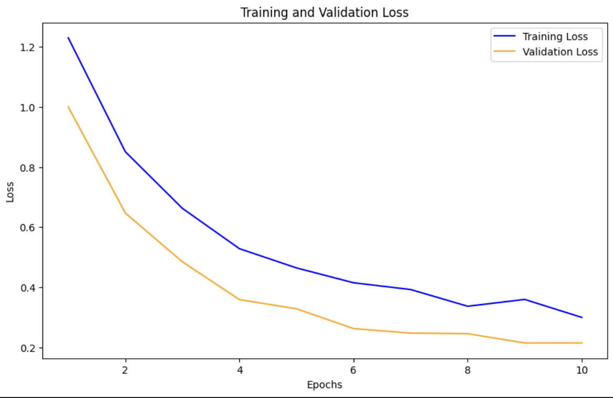

# Plant Pathology Classification Using Deep Learning

## Project Overview
This repository contains a deep learning project aimed at classifying plant diseases from images of leaves. The project utilizes DenseNet121 and EfficientNet models, incorporating modifications and ensemble techniques to optimize performance for plant pathology diagnostics.

## Table of Contents
- [Dataset](#dataset)
- [Data Preprocessing](#data-preprocessing)
- [Model Architectures](#model-architectures)
  - [Overview of Models Used](#overview-of-models-used)
  - [DenseNet121](#densenet121)
    - [Performance Without Weighted Loss](#performance-without-weighted-loss)
    - [Performance With Weighted Loss](#performance-with-weighted-loss)
  - [EfficientNetB1](#efficientnetb1)
  - [EfficientNetB2](#efficientnetb2)
  - [Ensemble Methods](#ensemble-methods)
    - [Average Ensemble](#average-ensemble)
    - [Soft Voting](#soft-voting)
- [Training Procedures](#training-procedures)
- [Evaluation and Results](#evaluation-and-results)
- [Visualizations](#visualizations)
  - [Batch Visualization](#batch-visualization)
- [Usage Example](#usage-example)
- [Contributing](#contributing)
- [Citations](#citations)
- [License](#license)

## Dataset

This project utilizes the Kaggle Plant Pathology 2020 - FGVC7 dataset, which comprises various categories of plant leaf images labeled as Healthy, Multiple Diseases, Rust, and Scab. The dataset is designed to reflect real-world conditions and train robust models capable of handling diverse plant conditions.

### Data Splitting

The dataset is split as follows to ensure the model's ability to generalize well on unseen data:
- **70% Training**
- **20% Validation**
- **10% Test**

This stratified split ensures that each set reflects the overall distribution of classes.

#### Class Distribution

The initial class distribution is as follows:
- **Healthy**: Approx. 550 images
- **Multiple Diseases**: Approx. 150 images
- **Rust**: Approx. 600 images
- **Scab**: Approx. 600 images

### Data Preprocessing

Images undergo several preprocessing steps to augment the dataset and normalize input data:
1. **Resizing**: Normalizing all images to 512x512 pixels to ensure consistency.
2. **Augmentations**: Enhancing dataset variance through techniques such as random flips, rotations, color adjustments, and applying Gaussian blur.
3. **Normalization**: Scaling pixel values to a predefined range based on dataset statistics to facilitate model convergence.

## Visualizations

### Batch Visualization

To ensure that each training batch is representative of the overall dataset, we monitor the class distribution within batches.

## Model Architectures

### Overview of Models Used

The project employs several models and techniques to address the challenges of plant pathology classification:
- DenseNet121
- EfficientNetB1
- EfficientNetB2
- Average Ensemble
- Soft Voting

### DenseNet121

DenseNet121 is a convolutional neural network that is distinct for its dense connectivity pattern. Unlike traditional networks, where each layer is connected only to the next layer, DenseNet connects each layer to every other layer in a feed-forward fashion. This unique architecture helps in alleviating the vanishing-gradient problem, strengthening feature propagation, encouraging feature reuse, and substantially reducing the number of parameters. DenseNet has proven to be effective in various image recognition tasks, particularly in areas where preserving fine details is crucial, such as medical imaging and plant pathology.

For a detailed performance analysis of DenseNet121 on plant pathology classification, see the [DenseNet121 section](#densenet121).

### DenseNet121 Performance Analysis

#### Performance without weighted Loss

##### Overview

This section evaluates the DenseNet121 model's performance without a weighted loss function, establishing a baseline for its capabilities and identifying areas for potential improvement.

##### Training and Validation Loss and Validation Accuracy

The Training and Validation Loss Plot shows how the model's performance changes over time. The training loss (blue line) indicates how well the model fits the training data, while the validation loss (orange line) assesses its generalization to unseen data. The Validation Accuracy Plot provides a crucial metric for assessing model effectiveness under varying training conditions.

- **Key Observation:** Steady decrease in training loss suggests effective learning, but the plateau in validation loss indicates possible overfitting.
- **Key Observation:** Increasing validation accuracy shows alignment with actual labels, though it plateaus, suggesting a limit to current model configuration benefits.

##### Confusion Matrix

The Confusion Matrix visualizes performance across classes, highlighting accurate classifications and misclassifications.

- **Key Observation:** High accuracy for most classes but notable misclassifications in 'Multiple Diseases'.

##### Classification Report

The table below summarizes the precision, recall, and F1 scores for each class before applying weighted loss.

| Class               | Precision | Recall | F1 Score | Support |
|---------------------|-----------|--------|----------|---------|
| Healthy             | 0.90      | 0.96   | 0.93     | 28      |
| Multiple Diseases   | 0.50      | 0.20   | 0.29     | 5       |
| Rust                | 0.97      | 0.94   | 0.96     | 34      |
| Scab                | 0.88      | 0.94   | 0.91     | 32      |
| **Accuracy**        |           |        | 0.91     | 99      |
| **Macro Avg**       | 0.81      | 0.76   | 0.77     | 99      |
| **Weighted Avg**    | 0.90      | 0.91   | 0.90     | 99      |

#### Performance with weighted Loss

##### Introduction

Implementing weighted loss addresses class imbalance by emphasizing minority classes during training, potentially enhancing overall model accuracy and equity.

##### Performance Metrics Post-Weighted Loss

Post-adjustment metrics indicate improved balance and performance across classes.

| Metric     | Value  |
|------------|--------|
| Precision  | 0.8602 |
| Recall     | 0.8623 |
| F1 Score   | 0.8601 |

##### Classification Report Post-Weighted Loss

Detailed performance per class after applying weighted loss highlights improvements.

| Class               | Precision | Recall | F1 Score | Support |
|---------------------|-----------|--------|----------|---------|
| Healthy             | 0.90      | 1.00   | 0.95     | 28      |
| Multiple Diseases   | 0.60      | 0.60   | 0.60     | 5       |
| Rust                | 1.00      | 0.91   | 0.95     | 34      |
| Scab                | 0.94      | 0.94   | 0.94     | 32      |
| **Accuracy**        |           |        | 0.93     | 99      |
| **Macro Avg**       | 0.86      | 0.86   | 0.86     | 99      |
| **Weighted Avg**    | 0.93      | 0.93   | 0.93     | 99      |

##### Training and Validation Loss Post-Weighted Loss

The plot below shows training and validation loss over epochs, indicating a closer convergence between training and validation loss, suggestive of reduced overfitting.

##### Validation Accuracy Plot Post-Weighted Loss

A steady increase in validation accuracy shows the model's improved performance, reaching an optimal point around the 6th epoch.

##### Updated Confusion Matrix

This matrix reflects improved recognition of under-represented classes and overall accurate predictions.

